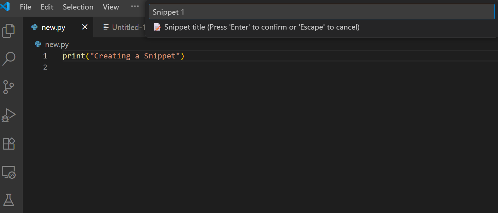
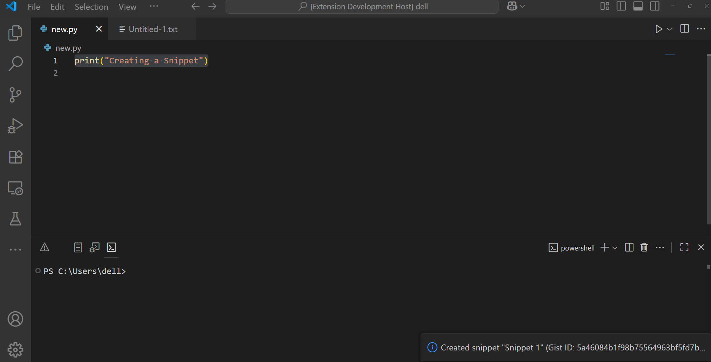
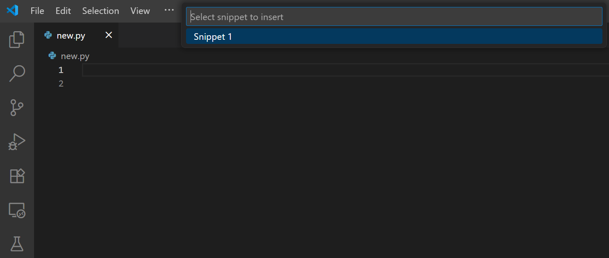
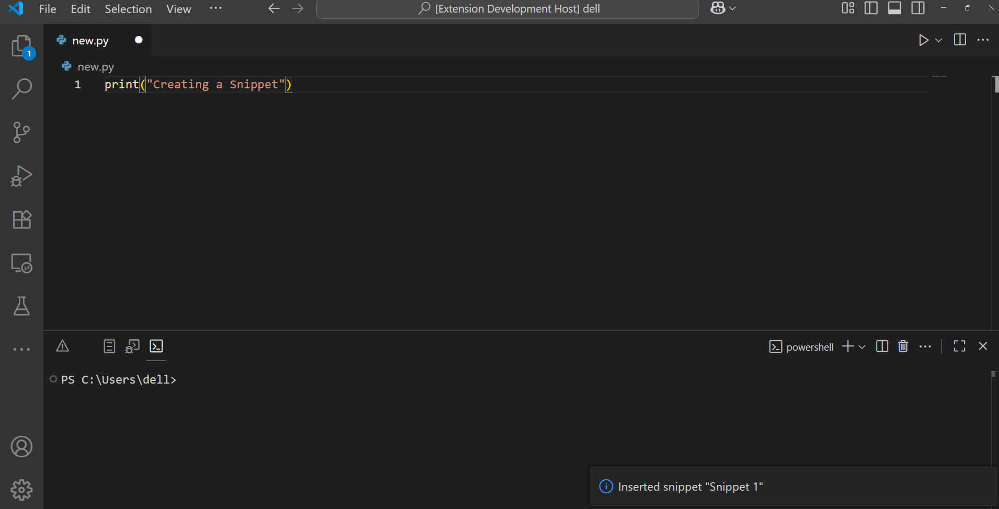

# SnipShare — VS Code Snippet Manager (v1)

[](https://marketplace.visualstudio.com/items?itemName=suryansh-it.snipshare-vscode-plugin)
[](https://marketplace.visualstudio.com/items?itemName=suryansh-it.snipshare-vscode-plugin)
[](./LICENSE)

**Short description**  
Save, search, and share **individual snippets** and **packs** via GitHub Gists — create packs, import packs, and paste snippets back into your editor in one keystroke.

---

## What is SnipShare?

SnipShare is a lightweight VS Code extension that helps you capture code from your editor, store it as GitHub Gists, and quickly re-insert or share those snippets with others. It supports single snippets and multi-snippet _packs_ (a pack is a Gist containing multiple files and a `manifest.json`).

**Key features**

- Create snippets from your selection or whole file
- Search and insert snippets at the cursor
- Share snippets (copy Gist link / raw URL / Markdown / open in browser)
- Create / import packs (manifest-based bundles)
- Simple PAT-based authentication (no OAuth device flow required in the MVP)
- Local cache (VS Code `globalState`) for faster access and offline reads

---

## Security note

Treat your GitHub Personal Access Token (PAT) like a password — **do not commit it to source control**.  
The extension stores the PAT in your user settings (`snipshare.githubToken`) and in extension `globalState` (memento) for convenience and offline functionality.

---

## Quick start

1. Open the project in VS Code and press `F5` to start an Extension Development Host (or install the built `.vsix`).
2. Run **SnipShare: Setup** from the Command Palette and paste a GitHub Personal Access Token (PAT) with the `gist` scope.
3. Use the commands (Command Palette or the configured keybindings):
   - `SnipShare: Create Snippet` — save selected code or entire file into a private Gist.
   - `SnipShare: Search Snippet` — find snippets by title/description and insert at the cursor.
   - `SnipShare: Share Snippet` — copy the Gist link, raw URL, Markdown, or open in browser.
   - `SnipShare: Create Pack` — bundle selected snippets into one Gist with `manifest.json`.
   - `SnipShare: Import Pack` — import a pack from a Gist URL or local JSON.
   - `SnipShare: Help` — open this README inside VS Code.

---

## Usage

### Create a snippet

1. Select code in the editor (or leave nothing selected to capture the whole file).
2. Run `SnipShare: Create Snippet` (or press `Ctrl+Alt+C` if keybinding enabled).
3. Enter a title — SnipShare creates a _private_ (secret) Gist and caches it locally.

> Behavior: when creating, SnipShare will use your selected text. If nothing is selected, it captures the entire active document.

## Create a snippet

<div style="display:flex; gap:12px; align-items:flex-start;">
  <figure style="margin:0;">
    
    <figcaption style="font-size:smaller">Select code and run command</figcaption>
  </figure>
  <figure style="margin:0;">
    
    <figcaption style="font-size:smaller">Snippet saved as private Gist</figcaption>
  </figure>
</div>

### Search & insert

1. Click the editor where you want the snippet inserted (cursor must be active).
2. Optionally select some text — SnipShare will use the selection as the search query automatically.
3. Run `SnipShare: Search Snippet` (or press `Ctrl+Alt+S`).
4. Choose a snippet from the QuickPick — it will be inserted at your cursor.

<div style="display:flex; gap:12px; align-items:flex-start;">
  <figure style="margin:0;">
    
    <figcaption style="font-size:smaller">Search results QuickPick</figcaption>
  </figure>
  <figure style="margin:0;">
    
    <figcaption style="font-size:smaller">Snippet inserted at cursor</figcaption>
  </figure>
</div>

### Share a snippet

1. Run `SnipShare: Share Snippet`.
2. Pick one snippet, then choose one of:
   - **Copy Gist link** (`html_url`)
   - **Copy Raw URL** (useful for programmatic consumption)
   - **Copy Markdown** (wrapped in triple-backticks for Slack/GitHub)
   - **Open in Browser**

> Note: Private (secret) Gists are accessible to anyone who has the URL.

### Packs (bundle multiple snippets)

- **Create Pack**: choose snippets to include; SnipShare will create one Gist containing multiple files and a `manifest.json`.
- **Import Pack**: paste a pack Gist URL or open a local manifest; SnipShare imports the included snippets into your cache.

**Pack manifest example**

```json
{
  "snipshare_pack_name": "React Utilities",
  "version": 1,
  "snippets": [
    { "title": "useDebounce", "file": "useDebounce.js" },
    { "title": "formatDate", "file": "formatDate.py" }
  ]
}
```

---

## Keybindings & Context Menu

Default keybindings (customizable in VS Code):

- `Ctrl+Alt+C` — Create snippet
- `Ctrl+Alt+S` — Search snippet

Context menu (right-click in editor):

- Create Snippet, Search Snippet, Share Snippet (appear when applicable, e.g., `editorHasSelection`).

---

## Troubleshooting

- **Network errors contacting GitHub** — ensure `https://api.github.com` is reachable. If behind a corporate proxy, configure `http.proxy` in VS Code or set `HTTP(S)_PROXY` env vars for the Extension Development Host.
- **Invalid token / 401** — re-generate a PAT and ensure it has the `gist` scope.
- **No active editor** — open a file before creating or inserting snippets.
- **Insert not appearing** — make sure an editor is focused before running Search; use the keyboard shortcut so selection/cursor do not get lost.
- **Device Flow / OAuth errors** — the current MVP uses PATs only (no device flow by default).

---

## Packaging & Publishing (brief)

**Install vsce**

```bash
npm install -g vsce
```

**Package locally**

```bash
vsce package
# produces: snipshare-vscode-plugin-<version>.vsix
```

**Publish** (one-time setup: create Marketplace publisher and PAT)

```bash
vsce publish minor --pat <MARKETPLACE_PAT>
```

- Use `minor` / `patch` / `major` to control semver increment, or set version in `package.json` then run `vsce publish`.

---

## Development notes

- Snippets are stored as GitHub Gists under your account.
- The extension caches fetched gist contents in VS Code `globalState` (memento) to allow offline reads and faster local search.
- Future roadmap (post-MVP): repo-based team packs, semantic search, snippet editing UI, improved sharing workflows.

---

## Contributing & License

This repository is licensed under the **MIT License** (see `LICENSE`). MIT allows reuse and redistribution.
If you prefer a proprietary (All Rights Reserved) model, replace `LICENSE` with your chosen license text.

---

## Support

Open an issue on GitHub with steps to reproduce and any logs printed in the **SnipShare Debug** output channel.

---

## Credits

Created by **suryansh-it**

---

## Privacy note (short)

- The extension stores your PAT locally in user settings and the extension `globalState`.
- Snippet content is sent only to GitHub (as Gist content) and not to any other third party.
- No analytic tracking or telemetry is collected by default (you can add this later with explicit opt-in).
